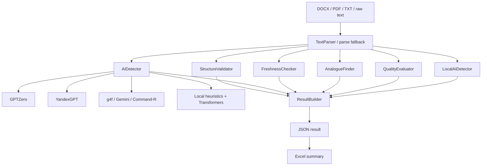

# AI Module for SPS Platform

Модуль анализа текстовых документов для SPS Platform. Проект принимает текст или файл с описанием идеи/аннотацией сервиса, прогоняет его через набор проверок и формирует итоговый JSON-отчёт: структура документа, вероятность ИИ-генерации, актуальность идеи, похожие аналоги и оценка качества проработки.

Основной сценарий проекта — массовая проверка `.docx`-документов из `moduleAI/data` и сохранение результатов в `moduleAI/results`. Также есть FastAPI-сервис, который позволяет запускать анализ через HTTP.

## Что умеет модуль

- извлекать текст из `.docx`, `.pdf` и `.txt`;
- разделять текст на секции или воспринимать его как свободное эссе;
- проверять наличие обязательных разделов;
- оценивать вероятность ИИ-генерации через несколько источников;
- искать устаревшие технологии, подходы и термины;
- подбирать похожие продукты, сервисы и стартапы;
- оценивать качество аннотации по содержательным критериям;
- собирать результаты в единый JSON;
- экспортировать результаты в Excel и сортировать исходные файлы по приоритету.

## Архитектура



Пайплайн реализован в `moduleAI/main.py` классом `TextAnalysisPipeline`. Он инициализирует все компоненты один раз и последовательно вызывает этапы анализа.

## Структура проекта

```text
.
├── ai_service.py                 # FastAPI-сервис для интеграции с SPS Platform
├── Dockerfile                    # Docker-образ для запуска API-сервиса
├── requirements.txt              # Зависимости для сервиса и полного проекта
├── export_summary.py             # Экспорт JSON-результатов в Excel
├── test.py                       # Быстрая проверка доступности модели через g4f
├── Lections.md                   # Дополнительные материалы/заметки
└── moduleAI/
    ├── main.py                   # Основной пайплайн анализа
    ├── batch_runner.py           # Массовый запуск анализа по DOCX-файлам
    ├── data/                     # Входные документы
    ├── results/                  # JSON-результаты анализа
    ├── exported_summary.py       # Расширенный экспорт результатов в Excel
    ├── exported_summary.xlsx     # Готовая Excel-сводка
    ├── sort_file.py              # Переименование DOCX по оценке и приоритету
    ├── parser/                   # Разбор текста на секции
    ├── validator/                # Проверка структуры документа
    ├── detector/                 # Детекторы ИИ-текста
    ├── relevance/                # Проверка актуальности идей/технологий
    ├── similarity/               # Поиск аналогов
    ├── evaluator/                # Оценка качества аннотации
    ├── aggregator/               # Сборка итогового результата
    ├── models/                   # Pydantic-модели входа/выхода
    ├── utils/                    # Общие утилиты
    └── keys/                     # Ключи Yandex Cloud
```

## Основные файлы и папки

### `ai_service.py`

HTTP-обёртка на FastAPI. Поднимает сервис с эндпоинтами:

- `GET /health` — проверка, что сервис жив;
- `POST /analyze/file` — анализ загруженного файла;
- `POST /analyze` — анализ файла по локальному пути.

Файл содержит fallback-парсер для `.docx`, `.pdf` и текстовых файлов. Это нужно, чтобы API мог стартовать и обработать документ даже если специализированный парсер недоступен.

Важно: сервис ожидает функциональные обёртки `validate`, `detect_ai`, `check_freshness`, `find_analogues`, `evaluate_quality`, `aggregate_result`. В текущем коде основная логика модулей реализована классами (`StructureValidator`, `AIDetector`, `FreshnessChecker` и т.д.), поэтому контракт API-сервиса и модульный пайплайн стоит синхронизировать перед промышленным запуском.

### `moduleAI/main.py`

Главная оркестрация анализа. `TextAnalysisPipeline.run()` выполняет этапы:

1. `TextParser.parse()` — выделяет секции документа.
2. `StructureValidator.validate()` — проверяет структуру.
3. `AIDetector.detect()` — запускает внешние и локальные детекторы ИИ.
4. `FreshnessChecker.check()` — ищет устаревшие идеи/термины.
5. `AnalogueFinder.find()` — подбирает похожие сервисы.
6. `QualityEvaluator.evaluate()` — оценивает качество аннотации.
7. `LocalAIDetector.detect()` — считает локальные эвристики и ML-признаки.
8. `ResultBuilder.build()` — собирает итоговый словарь.

### `moduleAI/batch_runner.py`

Скрипт для пакетной обработки документов. Берёт все `.docx` из `moduleAI/data`, извлекает текст, запускает `TextAnalysisPipeline` и сохраняет результат в `moduleAI/results/<имя_файла>_result.json`.

### `moduleAI/parser`

Разбор текста. Сейчас `TextParser` ищет нумерованные разделы вида `1. ...`, `2. ...`. Если таких разделов нет, текст считается свободным эссе и возвращается одним блоком `essay`.

### `moduleAI/validator`

Проверка структуры документа. Для структурированных идей ожидаются разделы `1`-`7`. Для свободного эссе валидация считается пройденной без проверки обязательных разделов.

### `moduleAI/detector`

Подсистема определения ИИ-генерации:

- `ai_detector.py` — агрегирует ответы GPTZero, YandexGPT, g4f-моделей и локального детектора;
- `gptzero.py` — клиент GPTZero API;
- `yandex.py` — клиент YandexGPT;
- `gpt4o.py` — проверка через g4f;
- `local.py` — локальный анализ на эвристиках, словарях и Transformers;
- `dictionary/` — словари маркеров, вводных слов, высокостилевой лексики и предлогов.

Итоговый вердикт строится по числу сигналов от разных источников.

### `moduleAI/relevance`

Проверка актуальности. `FreshnessChecker` отправляет текст в YandexGPT и несколько g4f-моделей с промптом на поиск устаревших технологий, терминов и подходов.

### `moduleAI/similarity`

Поиск аналогов. `AnalogueFinder` просит LLM подобрать 3-5 похожих стартапов, сервисов или продуктов и объяснить сходство/отличия.

### `moduleAI/evaluator`

Оценка качества аннотации. `QualityEvaluator` выставляет оценки по критериям:

- ясность идеи;
- акторы и роли;
- AS IS / TO BE;
- архитектура сервиса;
- реализуемость.

Ответы моделей парсятся в числовые оценки, чтобы потом можно было посчитать средний балл и приоритет.

### `moduleAI/aggregator`

`ResultBuilder` собирает результаты всех этапов в единый JSON:

```json
{
  "structure_validation": {},
  "ai_detection": {},
  "freshness_check": {},
  "similar_ideas": {},
  "quality_evaluation": {},
  "local_analysis": {}
}
```

### `moduleAI/utils`

Вспомогательные функции:

- `text_tools.py` — извлечение текста из `.docx`;
- `yandex_auth.py` — получение IAM-токена Yandex Cloud из JSON-ключа сервисного аккаунта.

### `moduleAI/data` и `moduleAI/results`

- `data/` — входные `.docx`-документы.
- `results/` — JSON-отчёты после анализа.

На момент составления README в `data/` находится 38 `.docx`-файлов, в `results/` — 42 JSON-результата.

## Установка

Рекомендуется использовать Python 3.12.

```bash
python -m venv .venv
source .venv/bin/activate
pip install -r requirements.txt
```

Для минимального запуска только внутреннего пакета можно ориентироваться на `moduleAI/requirements.txt`, но корневой `requirements.txt` полнее и подходит для FastAPI-сервиса, Excel-экспорта и анализа.

## Переменные окружения

Создайте `.env` в корне проекта или передайте переменные окружения другим способом:

```env
YANDEX_FOLDER_ID=<folder_id_yandex_cloud>
YANDEX_KEY_FILE=moduleAI/keys/authorized_key.json
GPTZERO_API_KEY=<api_key_gptzero>
GPTZERO_API_URL=https://api.gptzero.me/v2/detect
```

`YANDEX_KEY_FILE` необязателен: если он не указан, код ищет ключ по пути `moduleAI/keys/authorized_key.json`.

Не коммитьте реальные ключи, `.env` и приватные JSON-ключи сервисных аккаунтов в публичный репозиторий.

## Запуск пакетного анализа

Положите `.docx`-файлы в `moduleAI/data`, затем выполните:

```bash
cd moduleAI
python batch_runner.py
```

Результаты появятся в `moduleAI/results` в формате:

```text
<имя_документа>_result.json
```

## Запуск API-сервиса

Локально:

```bash
uvicorn ai_service:app --host 0.0.0.0 --port 5005 --reload
```

Проверка:

```bash
curl http://localhost:5005/health
```

Анализ файла по пути:

```bash
curl -X POST http://localhost:5005/analyze \
  -H "Content-Type: application/json" \
  -d '{"file_path":"moduleAI/data/example.docx","doc_type":"annotation"}'
```

Анализ загружаемого файла:

```bash
curl -X POST http://localhost:5005/analyze/file \
  -F "file=@moduleAI/data/example.docx" \
  -F "doc_type=annotation"
```

## Docker

Сборка:

```bash
docker build -t sps-ai-service .
```

Запуск:

```bash
docker run --env-file .env -p 5005:5005 sps-ai-service
```

Сервис будет доступен на `http://localhost:5005`.

Замечание: в `Dockerfile` есть `HEALTHCHECK` через `curl`, но `curl` не устанавливается отдельной зависимостью. Если healthcheck нужен внутри контейнера, добавьте `curl` в список `apt-get install`.

## Экспорт результатов в Excel

После появления JSON-файлов в `moduleAI/results`:

```bash
python export_summary.py
```

или расширенная версия:

```bash
python moduleAI/exported_summary.py
```

Итоговая таблица сохраняется в `moduleAI/exported_summary.xlsx`. В ней собираются структурная проверка, вердикты детекторов, анализ актуальности, аналоги, оценки качества, средний балл и приоритет.

## Сортировка исходных DOCX

`moduleAI/sort_file.py` читает Excel-сводку, рассчитывает приоритет по среднему баллу и переименовывает файлы в `moduleAI/data`:

```text
001_Высокий_9.20_Annotation_example.docx
```

Скрипт меняет имена файлов на диске, поэтому перед запуском стоит убедиться, что Excel-сводка актуальна.

## Формат итогового результата

Пример верхнего уровня JSON:

```json
{
  "structure_validation": {
    "is_essay": false,
    "valid": true,
    "missing_sections": [],
    "message": "Идея содержит все обязательные разделы."
  },
  "ai_detection": {
    "sources": {
      "gptzero": "12.30% вероятность ИИ (GPTZero)",
      "yandex": "...",
      "chatgpt": "...",
      "local": {}
    },
    "verdict": "Текст скорее всего написан человеком."
  },
  "freshness_check": {},
  "similar_ideas": {},
  "quality_evaluation": {},
  "local_analysis": {}
}
```

## Важные технические замечания

- Локальный детектор использует Transformers-модели `blanchefort/rubert-base-cased-sentiment` и `distilbert-base-uncased`. При первом запуске они могут скачиваться из Hugging Face.
- В `moduleAI/main.py` для macOS M1 включён `PYTORCH_ENABLE_MPS_FALLBACK=1`, но вычисления принудительно ориентированы на CPU.
- Внешние проверки зависят от доступности GPTZero, YandexGPT и g4f-провайдеров.
- Некоторые импорты внутри `moduleAI` написаны как локальные (`from models.input import ...`), поэтому пакетные скрипты удобнее запускать из директории `moduleAI`.
- В репозитории присутствует локальная виртуальная среда `moduleAI/.venv`, IDE-файлы и служебные `.DS_Store`. Обычно такие файлы не хранят в Git.

## Типовой поток работы

1. Подготовить `.env` и ключи.
2. Установить зависимости.
3. Положить документы в `moduleAI/data`.
4. Запустить `python moduleAI/batch_runner.py` или API-сервис.
5. Проверить JSON-файлы в `moduleAI/results`.
6. Сформировать Excel-сводку через `export_summary.py`.
7. При необходимости отсортировать исходные документы через `moduleAI/sort_file.py`.
